# Post-contenido Unidad 5: Fundamentos de Java Web (Servlets y JSP)

**Estudiante:** Nicolás Andrés Sánchez Villamizar
**Materia:** Programación Web, Universidad de Santander (UDES)

## Descripción

Este es el repositorio del laboratorio de la Unidad 5 de Programación Web. Es un solo proyecto Maven Web (`gestion-tareas`) que se trabajó en dos partes sobre el mismo dominio de tareas. En la Parte 1 armé el Servlet base con el ciclo GET/POST y el patrón Post/Redirect/Get. En la Parte 2 no creé otro proyecto, sino que extendí el mismo modelo `Tarea` y el mismo `TareasServlet` con filtrado combinado, una vista de detalle servida por un segundo Servlet y sesión para saludar al usuario y recordar el último filtro.

```
sanchez-post1-u5-pweb/
├── pom.xml
├── README.md
├── docs/capturas/
└── src/main/
    ├── java/com/ejemplo/
    │   ├── model/Tarea.java
    │   └── servlet/
    │       ├── TareasServlet.java
    │       └── DetalleTareaServlet.java
    └── webapp/
        ├── css/estilos.css
        ├── WEB-INF/
        │   ├── web.xml
        │   └── views/
        │       ├── tareas.jsp
        │       └── detalle.jsp
        └── index.jsp
```

## Parte 1: Servlet de gestión de tareas

`TareasServlet` atiende `/tareas`. Con GET pasa la lista a `tareas.jsp` usando `RequestDispatcher.forward`, y con POST procesa dos acciones: `agregar` (valida en el servidor que el título no venga vacío) y `eliminar`. Después de cada POST válido responde con un `sendRedirect` a `/tareas`, así el navegador hace un GET nuevo y al recargar la página no se vuelve a enviar el formulario. `index.jsp` redirige a `/tareas` para que la raíz de la app abra directamente la lista.

## Parte 2: Filtros, detalle y sesión

`TareasServlet` ahora filtra por texto (`q`), categoría (`cat`) y prioridad (`prioridad`) al mismo tiempo, y suma las acciones `completar` e `identificar`. Se agregó `DetalleTareaServlet` en `/tareas/detalle`, que lee la misma lista desde `applicationScope` y hace forward a `detalle.jsp`, donde la fecha límite sale formateada con `fmt:formatDate`. `HttpSession` guarda el nombre del usuario identificado y el último filtro aplicado. Los estilos pasaron a `css/estilos.css` porque ya hay dos vistas.

## Decisiones de diseño

### Parte 1

- **La lista de tareas es variable de instancia** ([TareasServlet.java#L23-L24](https://github.com/NicolasSnchz/sanchez-post1-u5-pweb/blob/main/src/main/java/com/ejemplo/servlet/TareasServlet.java#L23-L24)). El contenedor crea una sola instancia del Servlet y la comparten todos los hilos, por eso una variable de instancia no sirve para guardar datos de una petición. Pero la lista no es un dato de una petición, es el estado de toda la aplicación y todas las peticiones tienen que ver la misma. Lo que sí es propio de cada petición, como el `titulo` que llega en el POST, queda como variable local del método.
- **Patrón Post/Redirect/Get** ([TareasServlet.java#L143](https://github.com/NicolasSnchz/sanchez-post1-u5-pweb/blob/main/src/main/java/com/ejemplo/servlet/TareasServlet.java#L143)). Todas las acciones POST terminan en un 302 hacia `/tareas`. Si respondiera la vista directamente desde el POST, al recargar el navegador preguntaría si reenviar el formulario y se duplicaría la tarea. En la captura de terminal de la Parte 1 se ve el `302` con `Location: /gestion-tareas/tareas`.
- **Validación en el servidor**. El input tiene `required`, pero eso lo puede saltar cualquiera (por ejemplo con curl o mandando solo espacios). Por eso el Servlet revisa `titulo.isBlank()` y, si falla, hace forward a la vista con el mensaje de error en vez de redirigir, porque el mensaje vive en el request y con un redirect se perdería.

### Parte 2

- **Filtro combinado** ([TareasServlet.java#L82-L88](https://github.com/NicolasSnchz/sanchez-post1-u5-pweb/blob/main/src/main/java/com/ejemplo/servlet/TareasServlet.java#L82-L88)). Son tres `filter` encadenados y cada uno deja pasar todo cuando su parámetro viene vacío o no viene. Así funciona cualquier combinación: solo texto, solo categoría, categoría más prioridad o los tres juntos.
- **El filtro y el usuario van en sesión, no en el request** ([TareasServlet.java#L61-L76](https://github.com/NicolasSnchz/sanchez-post1-u5-pweb/blob/main/src/main/java/com/ejemplo/servlet/TareasServlet.java#L61-L76) y [L138](https://github.com/NicolasSnchz/sanchez-post1-u5-pweb/blob/main/src/main/java/com/ejemplo/servlet/TareasServlet.java#L138)). Un atributo de request desaparece cuando termina esa petición, y el usuario va y vuelve entre `/tareas` y `/tareas/detalle` varias veces. `HttpSession` dura toda la visita, entonces si la URL no trae parámetros se restaura lo que quedó guardado. En cambio la lista ya filtrada sí va en el request ([L95](https://github.com/NicolasSnchz/sanchez-post1-u5-pweb/blob/main/src/main/java/com/ejemplo/servlet/TareasServlet.java#L95)), porque es solo el resultado de esa respuesta y se puede recalcular con el filtro.
- **La lista se comparte por applicationScope** ([TareasServlet.java#L40](https://github.com/NicolasSnchz/sanchez-post1-u5-pweb/blob/main/src/main/java/com/ejemplo/servlet/TareasServlet.java#L40) y [DetalleTareaServlet.java#L27](https://github.com/NicolasSnchz/sanchez-post1-u5-pweb/blob/main/src/main/java/com/ejemplo/servlet/DetalleTareaServlet.java#L27)). `DetalleTareaServlet` no tiene su propia copia, lee la misma referencia desde el `ServletContext`. Así cuando se completa o se elimina una tarea, los dos Servlets ven el cambio sin tener que sincronizar nada.
- **Forward en el detalle, no redirect** ([DetalleTareaServlet.java#L39-L43](https://github.com/NicolasSnchz/sanchez-post1-u5-pweb/blob/main/src/main/java/com/ejemplo/servlet/DetalleTareaServlet.java#L39-L43)). Ver el detalle es una lectura (GET) que solo tiene que entregarle a la vista un objeto que ya encontré. Con `sendRedirect` el objeto `Tarea` se perdería y el navegador haría una segunda petición sin ese dato. El redirect lo dejo para los POST, donde sí necesito un GET limpio, y para los errores (`no-encontrada`, `id-invalido`), donde quiero que la URL termine en el listado.
- **Hoja de estilos externa**. En la Parte 1 el `<style>` estaba embebido porque había una sola vista. Con `detalle.jsp` me tocaría duplicarlo y mantener las dos copias iguales a mano, así que lo pasé a `css/estilos.css` y las dos vistas lo cargan con un `<link>` ([tareas.jsp#L10](https://github.com/NicolasSnchz/sanchez-post1-u5-pweb/blob/main/src/main/webapp/WEB-INF/views/tareas.jsp#L10)).

## Correcciones que le hice al enunciado

Revisando el código de la guía contra la rúbrica y los checkpoints encontré algunas cosas que no cuadraban o que fallaban al probar. Las corregí así:

1. **El detalle fallaba con error 500 después de reiniciar Tomcat.** `TareasServlet.init()` es el que publica la lista en `applicationScope`, pero por defecto Tomcat solo llama `init()` en la primera petición a `/tareas`. Si alguien entraba directo a `/tareas/detalle?id=1`, `getAttribute("tareas")` devolvía `null` y salía un `NullPointerException`. Le puse `loadOnStartup = 1` ([TareasServlet.java#L16](https://github.com/NicolasSnchz/sanchez-post1-u5-pweb/blob/main/src/main/java/com/ejemplo/servlet/TareasServlet.java#L16)) para que el Servlet se inicialice al desplegar. En la captura de terminal de la Parte 2 el primer comando después de reiniciar es justamente el detalle y responde bien.
2. **La fecha límite no salía formateada.** Probando con curl, `fmt:formatDate` mostraba `Wed Oct 07 12:21:26 COT 2026` en vez de `07/10/2026`. Pasa porque JSTL usa `Date.toString()` cuando la petición no trae `Accept-Language`. Agregué el parámetro `jakarta.servlet.jsp.jstl.fmt.fallbackLocale` con `es-CO` en [web.xml#L11](https://github.com/NicolasSnchz/sanchez-post1-u5-pweb/blob/main/src/main/webapp/WEB-INF/web.xml#L11), y así el checkpoint de "fecha límite formateada" se cumple con cualquier cliente.
3. **El error `id-invalido` no se mostraba.** `DetalleTareaServlet` redirige con `?error=id-invalido`, pero la vista de la guía solo tenía mensaje para `no-encontrada`. Le agregué su mensaje en [tareas.jsp#L36](https://github.com/NicolasSnchz/sanchez-post1-u5-pweb/blob/main/src/main/webapp/WEB-INF/views/tareas.jsp#L36).
4. **Al fallar la validación la vista quedaba incompleta.** En la Parte 2 el forward de error mandaba solo la lista sin filtrar, sin `categorias` ni el filtro activo, entonces el select de categorías quedaba vacío. Ahora el error llama a `doGet` ([TareasServlet.java#L117](https://github.com/NicolasSnchz/sanchez-post1-u5-pweb/blob/main/src/main/java/com/ejemplo/servlet/TareasServlet.java#L117)), que arma la vista completa con el filtro de la sesión.
5. **Un `id` que no es número tumbaba el POST.** `Integer.parseInt` en `eliminar` y `completar` lanzaba `NumberFormatException` y respondía 500. Lo saqué a [`leerId`](https://github.com/NicolasSnchz/sanchez-post1-u5-pweb/blob/main/src/main/java/com/ejemplo/servlet/TareasServlet.java#L147), que devuelve -1 y la acción simplemente no encuentra tarea.
6. **Concurrencia en la lista compartida.** La guía usa `ArrayList` e `int` para algo que, como ella misma explica, comparten todos los hilos. Un `stream()` mientras otro hilo hace `removeIf` puede lanzar `ConcurrentModificationException`, y `contadorId++` no es atómico, así que dos tareas podían quedar con el mismo id. Usé `CopyOnWriteArrayList` y `AtomicInteger` ([TareasServlet.java#L23-L24](https://github.com/NicolasSnchz/sanchez-post1-u5-pweb/blob/main/src/main/java/com/ejemplo/servlet/TareasServlet.java#L23-L24)). Encaja bien porque la lista se lee en cada GET y se modifica poco.
7. **Títulos y nombre sin escapar.** `${t.titulo}` y el saludo mostraban tal cual lo que escribe el usuario, entonces una tarea llamada `<script>...` se ejecutaba en el navegador. Los cambié por `<c:out>` y el campo de búsqueda por `fn:escapeXml` ([tareas.jsp#L77](https://github.com/NicolasSnchz/sanchez-post1-u5-pweb/blob/main/src/main/webapp/WEB-INF/views/tareas.jsp#L77), [L18](https://github.com/NicolasSnchz/sanchez-post1-u5-pweb/blob/main/src/main/webapp/WEB-INF/views/tareas.jsp#L18) y [L42](https://github.com/NicolasSnchz/sanchez-post1-u5-pweb/blob/main/src/main/webapp/WEB-INF/views/tareas.jsp#L42)).
8. **pom.xml.** Cambié `maven.compiler.source/target` por `maven-compiler-plugin` 3.13.0 con `release 17`, porque compilo con JDK 23 y así se garantiza bytecode y API de Java 17. También fijé la versión de `maven-war-plugin` y puse `finalName` en `gestion-tareas`, para que el WAR quede con el mismo nombre del contexto que usa la guía (`/gestion-tareas`).

Otros detalles menores: los textos con tilde dentro de los `.java` están escritos como `ó`, `í`, etc., para que no haya problemas de codificación al compilar en Windows (en pantalla se ven normal), y las capturas quedaron en `docs/capturas/` en vez de `img/`.

## Cómo compilar y desplegar

Requisitos: JDK 17 o superior (yo uso JDK 23), Maven 3.8+ y Apache Tomcat 10.1.

1. Clonar el repositorio:
   ```
   git clone https://github.com/NicolasSnchz/sanchez-post1-u5-pweb.git
   ```
2. Compilar y empaquetar:
   ```
   mvn clean package
   ```
   Esto genera `target/gestion-tareas.war`.
3. Desplegar en Tomcat de alguna de estas dos formas:
   - Copiar `target/gestion-tareas.war` a la carpeta `webapps/` de Tomcat e iniciarlo.
   - En IntelliJ: Run, Edit Configurations, agregar Tomcat Server (Local) y en la pestaña Deployment agregar el artefacto `gestion-tareas:war exploded` con contexto `/gestion-tareas`.
4. Abrir http://localhost:8080/gestion-tareas/tareas

## Capturas de pantalla

### Parte 1

Lista inicial con las 2 tareas que carga `init()`:

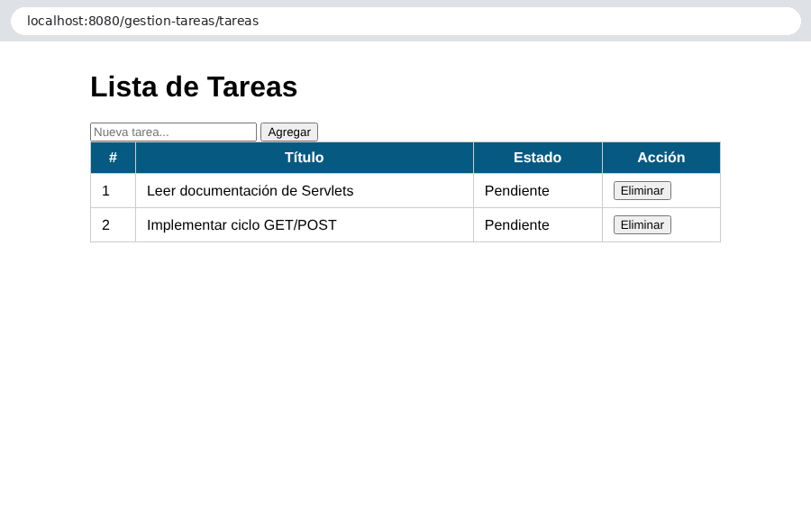

Validación en el servidor al enviar un título con solo espacios (no se agrega nada):

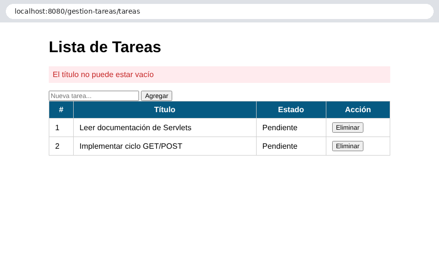

Tarea agregada; la URL queda en `/tareas` por el redirect (PRG):

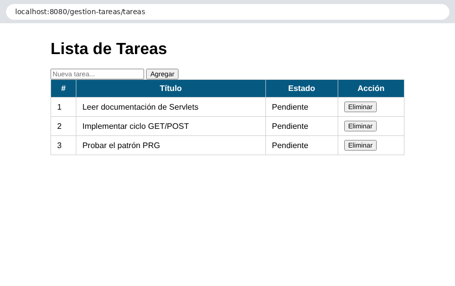

Tarea eliminada y la URL sigue en `/tareas`:

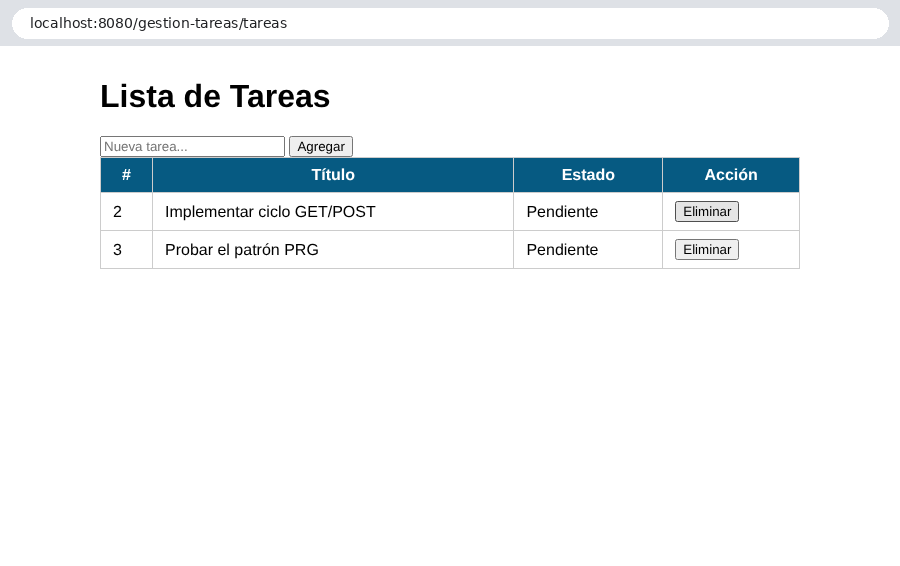

Compilación, despliegue en Tomcat 10.1 y respuestas HTTP de cada flujo (302 en los POST válidos, 200 con mensaje en el inválido):

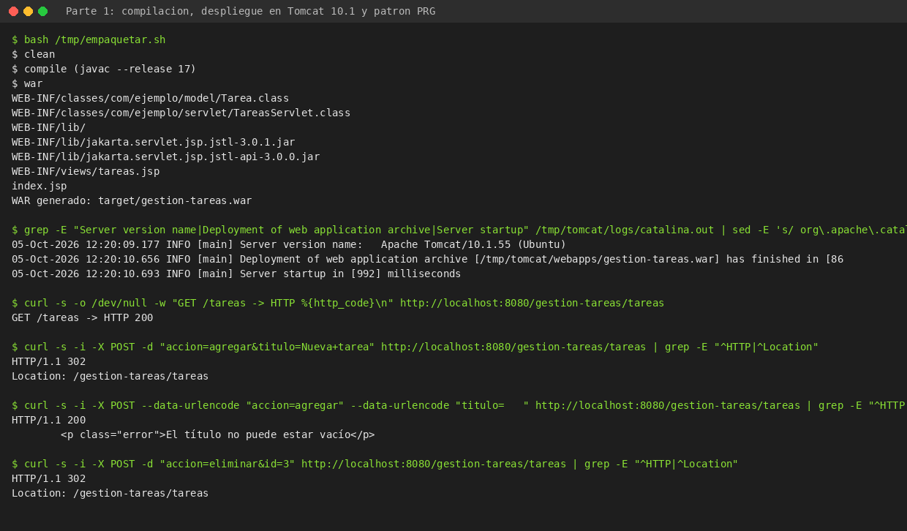

### Parte 2

Filtro combinado `?cat=Estudio&prioridad=Alta` con el usuario ya identificado en sesión:

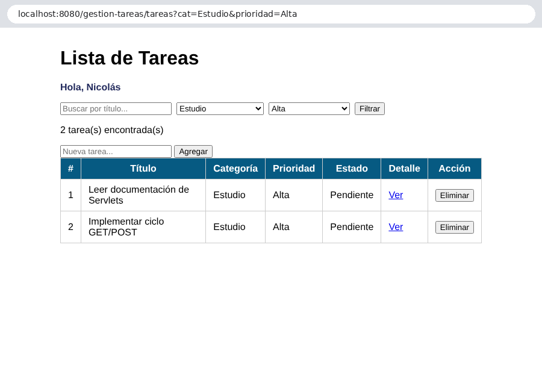

Detalle de una tarea con la fecha límite formateada:

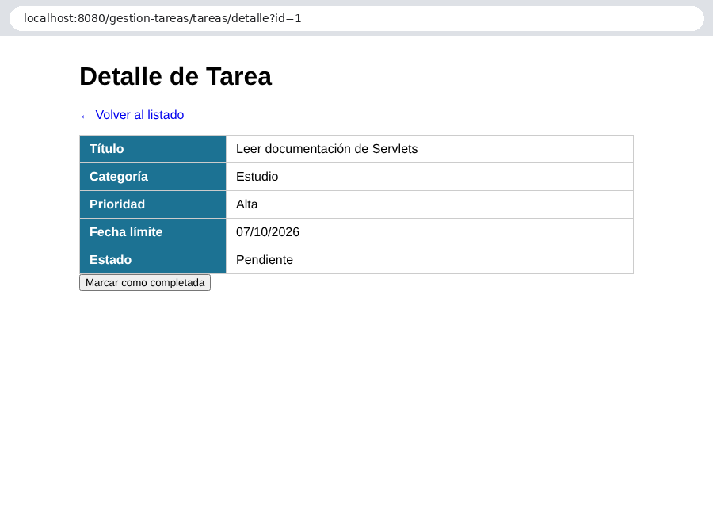

Después de marcarla como completada desde el detalle, el PRG lleva a `/tareas` sin parámetros, el filtro se restaura desde la sesión y la tarea aparece tachada:

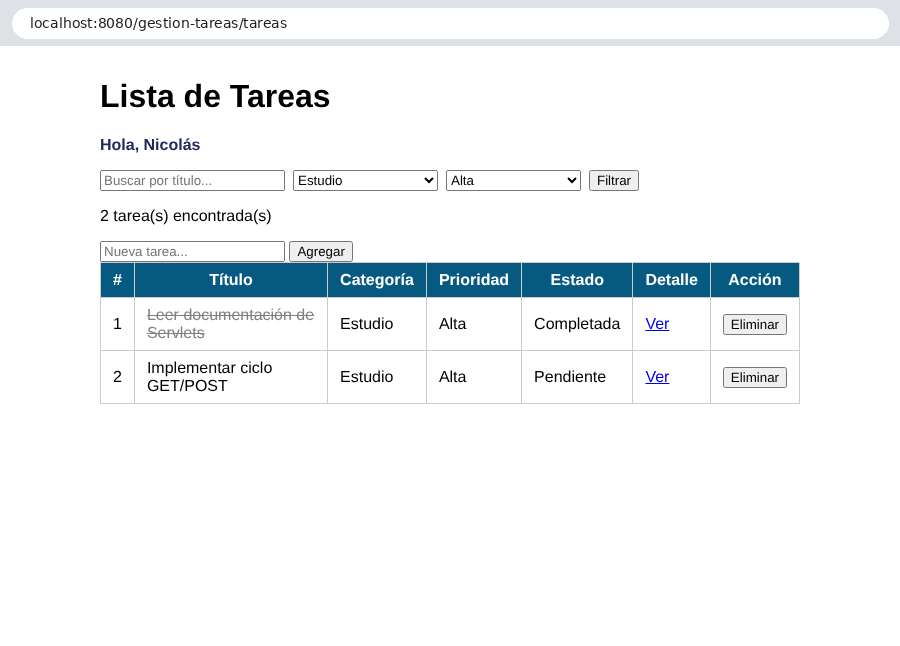

Búsqueda por texto (`jstl`), sin distinguir mayúsculas:

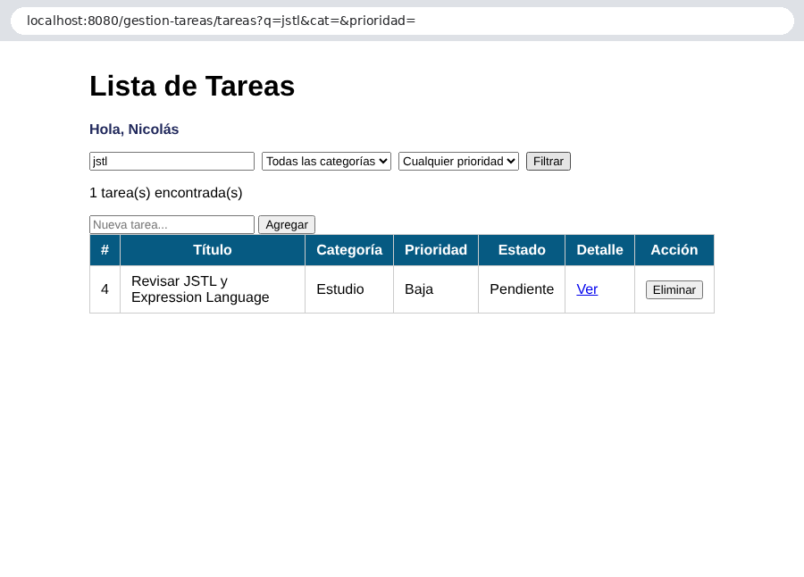

Detalle de una tarea que no existe (`id=99`): redirige al listado con el mensaje y conserva el filtro de la sesión:

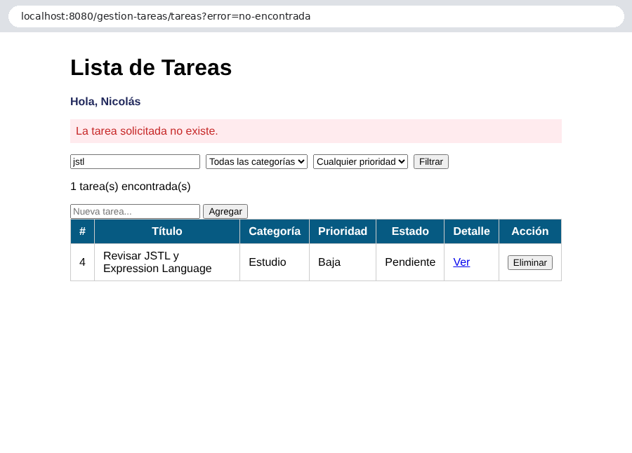

Terminal de la Parte 2: detalle pedido justo después de reiniciar (gracias a `loadOnStartup`), filtro combinado, filtro restaurado con la cookie de sesión, completar con PRG y log de Tomcat sin errores:

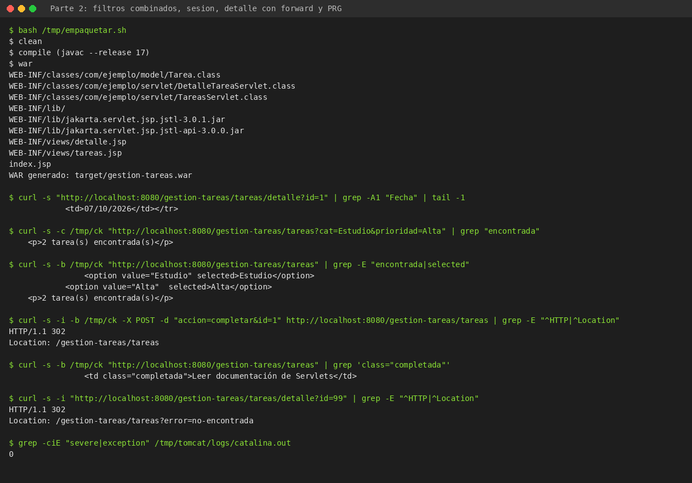
